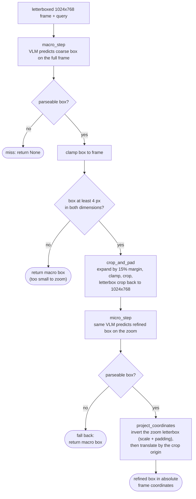

# pointer-agent

> **Work in progress.** The training/inference code is built and unit-verified,
> but no full training run has been done yet and the PointerBench eval harness
> is not written. Numbers to come.

GUI text grounding: given a screenshot and a natural-language instruction,
predict the pixel bounding box of the target text. The goal is to beat the
`pointerbench-text` benchmark ([WarmwindOS/pointerbench](https://huggingface.co/datasets/WarmwindOS/pointerbench))
with a small open model.

**Approach:** a single VLM (Qwen2.5-VL-3B-Instruct) fine-tuned in two stages,
plus an agentic inference loop:

1. **SFT** — LoRA over the language blocks *and* the vision tower, teaching the
   coordinate contract: letterboxed 1024x768 frame in, `<box> [x0, y0, x1, y1] </box>` out.
2. **GRPO** — RL on top of the merged SFT model with a reward mirroring
   PointerBench's asymmetric rule (coverage ≥ 0.90 is a hard floor, precision
   weighted in; plus a strict-format bonus).
3. **Zoom-and-verify inference** (`src/agent/pipeline.py`) — coarse box on the
   full frame → crop with 15% margin → re-letterbox → refined box → project
   back to absolute frame coordinates.



**Training data** (downloaded automatically from the HF Hub on first run):
[OS-Atlas](https://huggingface.co/datasets/OS-Copilot/OS-Atlas-data)
(linux + macos desktop sources, ~8.6 GB) mixed 70/30 with financial-report
text cells from [DocLayNet-v1.1](https://huggingface.co/datasets/docling-project/DocLayNet-v1.1)
(~7.8 GB) to cover pointerbench-text's dense-document distribution.
PointerBench itself is eval-only, never trained on.

## Layout

```
conf/          Hydra config groups: data/, model/, train_sft/, train_grpo/
src/data/      letterbox + coordinate transforms, dataset loaders, mixing
src/agent/     zoom-and-verify inference pipeline
src/utils/     PointerBench-style reward functions
src/train_sft.py   stage 1 (trl SFTTrainer + peft LoRA)
src/train_grpo.py  stage 2 (trl GRPOTrainer, fresh LoRA over merged SFT)
```

## Running

Needs a CUDA GPU (bf16) and Python 3.13. Fresh setup:

```bash
python -m venv venv && venv/bin/pip install -r requirements.txt
```

Log in to W&B first (`wandb login`) or run with `wandb.mode=offline`.

**Stage 1 — SFT** (first run downloads the datasets, then trains; adapter
lands in `outputs/sft_model`):

```bash
venv/bin/python -m src.train_sft
# multi-GPU
accelerate launch -m src.train_sft
```

**Stage 2 — GRPO** (requires `outputs/sft_model`; adapter lands in
`outputs/grpo_model`):

```bash
venv/bin/python -m src.train_grpo
```

Anything in `conf/` can be overridden on the CLI, e.g.:

```bash
venv/bin/python -m src.train_sft train_sft.lr=1e-5 data.mix_ratio=[0.8,0.2] wandb.mode=offline
```

Note: the final GRPO artifact is an adapter over the *merged* SFT model —
to run it, load the base model, merge `outputs/sft_model`, then attach
`outputs/grpo_model`.

## Still to do

- PointerBench eval harness (fetch `pointerbench-text`, run the agent,
  score with the official rules; point tasks answered with the box center)
- First real SFT + GRPO runs and a phase-by-phase results table
